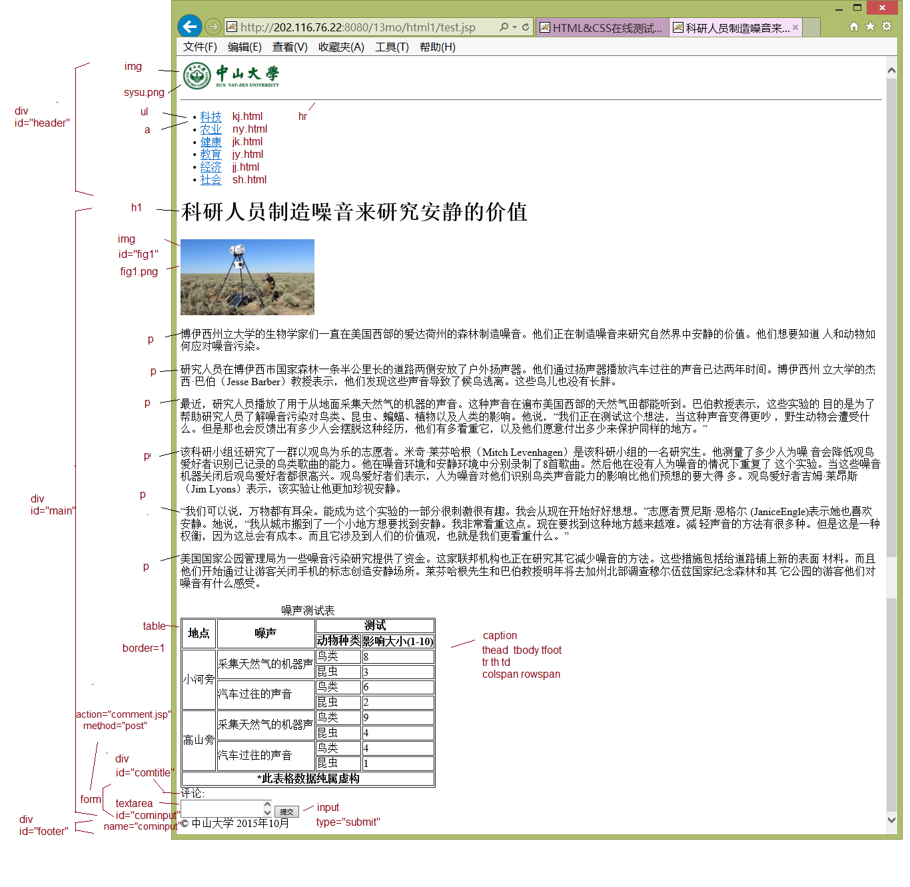
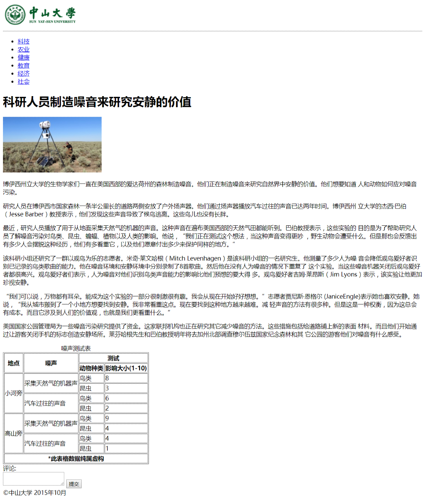
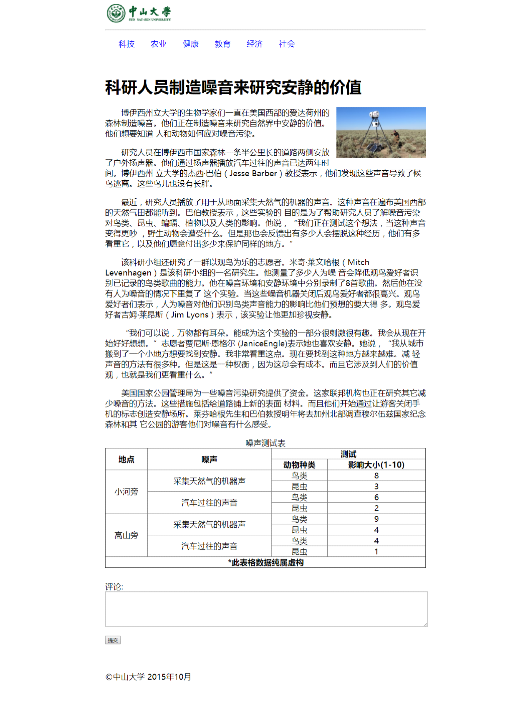
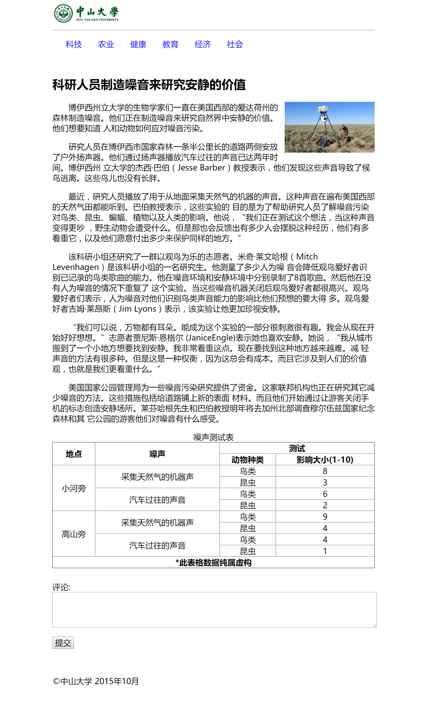

# HTML&CSS实验(1)

## 步骤1

**题目描述**：根据下图提示(标出了元素)尽可能做出相似的网页（文字包含在html1.txt中）。其中包含的图像(sysu.png，fig1.png)和链接的网页(kj.html~sh.html)都在当前路径中；有一些元素下面标出了属性; 最后一行使用了div元素(id="footer")。

实现代码位于<a href="./code/answer/1.html">【这里】</a>，实现效果如下：

## 步骤2

**题目描述**：在步骤1的网页的head元素中加入以下style元素,运行后截屏浏览器。
'''python

'''

实现代码位于<a href="./code/answer/2.html">【这里】</a>，实现效果如下：

## 步骤3

**题目描述**：将步骤1完成的网页中id为"header"、"main"、"footer"的div元素分别换成html5的元素header、article、footer，运行后截屏。

实现代码位于<a href="./code/answer/3.html">【这里】</a>，实现效果如下：

## 步骤4

**题目描述**：把步骤3完成的网页中的head元素中加入以下style元素：
'''css

'''

实现代码位于<a href="./code/answer/4.html">【这里】</a>，实现效果如下：

