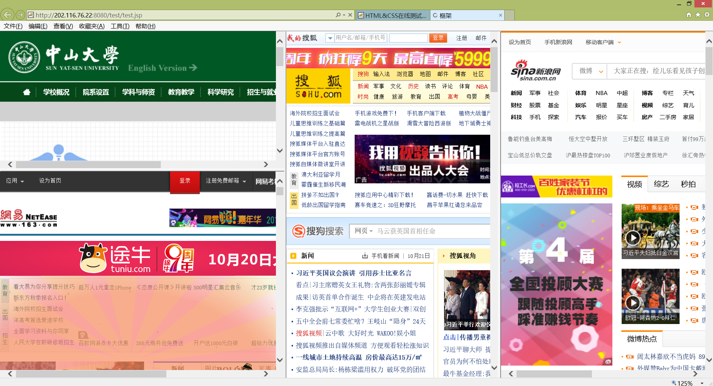
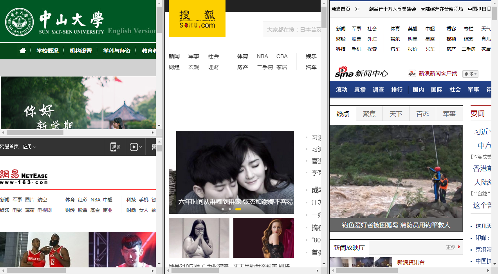
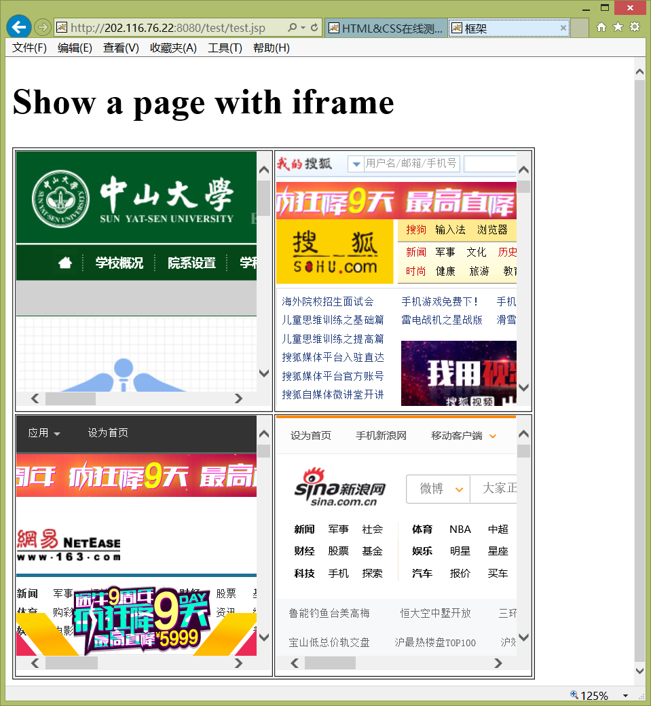
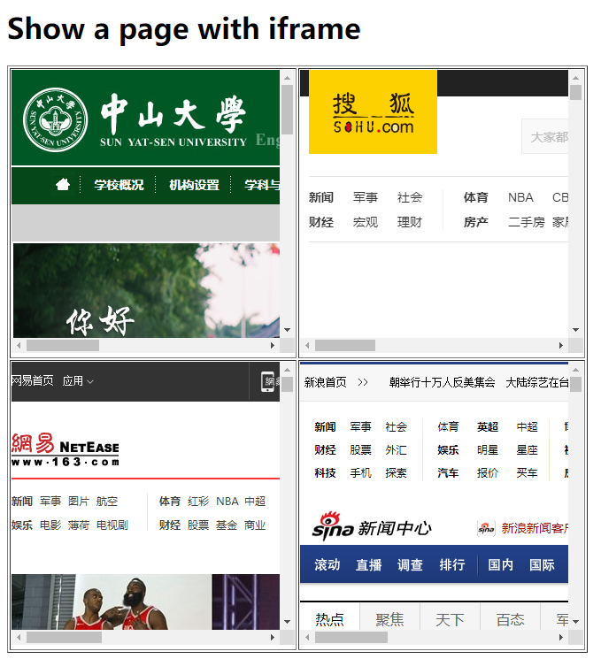
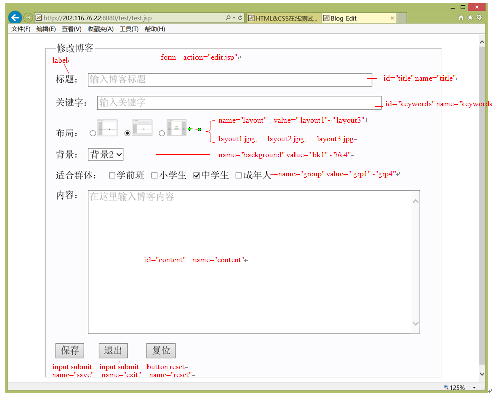
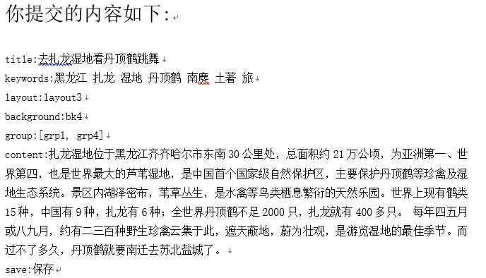
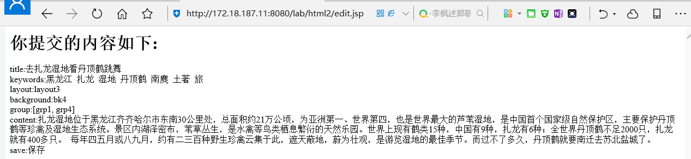
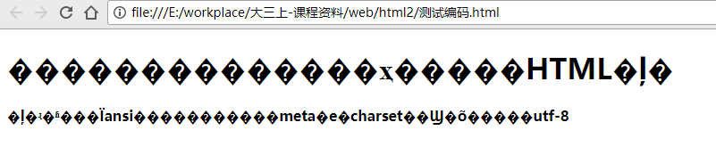

# HTML&CSS实验(2)

## 步骤1

**题目描述**：用框架（frameset和frame）实现下图（比例自己定，浏览器可能要设置为兼容模式）：



实现效果截屏：



实现代码如下：

```html
<!DOCTYPE html>
<html>
    <head>
        <meta content="text/html; charset=utf-8" />
    </head>
    <frameset cols="33%,33%,*">
        <frameset rows="50%,*">
            <frame src="http://www.sysu.edu.cn">
            <frame src="http://www.163.com">
        </frameset>    
        <frame src="http://www.sohu.com">
        <frame src="http://news.sina.com.cn">
    </frameset>
    <noframes>
        <body> Your browser does not handle frames! </body>
    </noframes>
</html>
```

## 步骤2

**题目描述**：在iframe实现下图iframe(高度和宽度自己定)，用了一个具有4个单元格的table放置四个iframe ：



实现效果截屏：



实现代码如下：
```html
<!DOCTYPE html>
<html>
    <head>
        <meta content="text/html; charset=utf-8" />
    </head>
    <body>
        <h1>Show a page with iframe </h1>
        <table border="1">
            <thead>
                <th>
                    <iframe width="320" height="320" frameborder="0" scrolling="yes" src="http://www.sysu.edu.cn">
                        Your browser does not handle frames!
                    </iframe>
                </th>
                <th>
                    <iframe width="320" height="320" frameborder="0" scrolling="yes" src="http://www.sohu.com">
                        Your browser does not handle frames!
                    </iframe>
                </th>            
            </thead>
            <tfoot>
                <th>
                    <iframe width="320" height="320" frameborder="0" scrolling="yes" src="http://www.163.com">
                        Your browser does not handle frames!
                    </iframe>
                </th>
                <th>
                    <iframe width="320" height="320" frameborder="0" scrolling="yes" src="http://news.sina.com.cn">
                        Your browser does not handle frames!
                    </iframe>
                </th>            
            </tfoot>        
        </table>
    </body>
</html>
```

## 步骤3

**题目描述**：修改模板<a herf="./code/blog.html">blog.html</a>实现下面输入页面(尽量类似，包括选项和提示文字)：
* 不要使用placeholder属性



实现效果截屏：


实现代码如下：

```html
<!DOCTYPE  html>
<html lang="zh-cn">
    <head>
        <meta charset="utf-8">
        <title>Blog Edit</title>
        <style type="text/css">
            *{font-size:20px;font-family:宋体}
            input[type="text"],textarea {color:#B0B0B0}
            [for="content"]{vertical-align:top;}
            fieldset {width:800px;margin:20px auto;padding:20px;background-color:#FCFCFF;}
            #content {width:700px;height:300px}
        </style>
    </head>
    <body>
    <form action="http://172.18.187.11:8080/lab/html2/edit.jsp" method="post" enctype="application/x-www-form-urlencoded">
    <fieldset>
        <legend>修改博客</legend>
        <!-- for属性的作用是：当点击label元素时，光标会聚焦到对应id的input元素上 -->
        <label for="title">标题：</label>
        <input id="title" name="title" type="text" size="60">
        <br><br>
        <label for="keywords">关键字：</label>
        <input id="keywords" name="keywords" type="text" size="60">   
        <br><br>
        布局：<input name="layout" type="radio" value="layout1">
        
        <input name="layout" type="radio" value="layout2">
        
        <input name="layout" type="radio" value="layout3">
        
        <br><br>
        <label for="background">背景：</label>
        <select name="background">
        <option value="bk1">背景1</option>
        <option value="bk2">背景2</option>
        <option value="bk3">背景3</option>
        <option value="bk4">背景4</option>
        </select>
        <br><br>
        适合群体：<input name="group" type="checkbox" value="grp1">学前班
        <input name="group" type="checkbox" value="grp2">小学生
        <input name="group" type="checkbox" value="grp3">中学生
        <input name="group" type="checkbox" value="grp4">成年人    
        <br><br>
        <lable for="content">内容：</label>
        <textarea id="content" name="content" rows="6" cols="30"></textarea>
        <br><br>
        <input name="save" type="submit" value="保存">
        <input name="exit" type="submit" value="退出">
        <input name="reset" type="reset" value="复位">
        </fieldset>  
    </form>
    <script type="text/javascript">
    function inputClick(target){
        var value="";
        if(target.id=="title")
            value="输入博客标题";
        if(target.id=="keywords")
            value="输入关键字";
        if(target.id=="content")
            value="在这里输入博客内容";

        if(target.value==''){
        target.style.color="#B0B0B0";
        target.value=value;
        }
        else 
        if(target.value==value){
            target.style.color="#000000";
            target.value="";
        }
    };
    var f1=function(){inputClick(this);};
    document.getElementById("title").onclick= f1;
    document.getElementById("keywords").onclick= f1;
    document.getElementById("content").onclick= f1;
    //document.getElementById("title").onblur= f1;
    //document.getElementById("keywords").onblur= f1;
    //document.getElementById("content").onblur= f1;
    </script>
    </body>
</html>
```

## 步骤4

**题目描述**：输入内容并点击保存后，需要得到如下内容：



相应的文本为：

```
title:去扎龙湿地看丹顶鹤跳舞
keywords:黑龙江 扎龙 湿地 丹顶鹤 南麂 土著 旅
layout:layout3
background:bk4
group:[grp1, grp4]
content:扎龙湿地位于黑龙江齐齐哈尔市东南30公里处，总面积约21万公顷，为亚洲第一、世界第四，也是世界最大的芦苇湿地，是中国首个国家级自然保护区，主要保护丹顶鹤等珍禽及湿地生态系统。景区内湖泽密布，苇草丛生，是水禽等鸟类栖息繁衍的天然乐园。世界上现有鹤类15种，中国有9种，扎龙有6种；全世界丹顶鹤不足2000只，扎龙就有400多只。 每年四五月或八九月，约有二三百种野生珍禽云集于此，遮天蔽地，蔚为壮观，是游览湿地的最佳季节。而过不了多久，丹顶鹤就要南迁去苏北盐城了。
save:保存

```
实现效果截屏：



## 步骤5

**题目描述**：点击步骤4中的退出按钮，说明出现的结果与点击保存按钮有什么不同，原因是什么?点击复位按钮看现象，说明它的功能是什么？

答：
- 出现的现象是上面的那张图片的最后一行文字由“save:保存”改为“exit:退出”,原因是退出按钮也是submit，其会提交数据到edit.jsp上，但是其中的value是退出，其name为exit。简单的说，区别就在于如下的两行代码：
    ```html
            <input name="save" type="submit" value="保存">
            <input name="exit" type="submit" value="退出">
    ```
- 点击复位按钮后表单上可填的所有信息全部还原到最初的状态，也即是默认状态，其功能是还原当前表单上的所有已选择或输入内容为默认状态。

## 步骤6

**题目描述**：每个网页都是某种编码的文本文件（可以用记事本的“另存为”进行转换），常用的编码有ansi（中文windows下为gb2312）和utf-8。我们可以用meta元素提示浏览器网页采用了什么编码，请设计一个简单实验，让网页给出的提示(utf-8)与网页本文文件实际使用的编码(ansi)不一致时出现乱码，然后截屏浏览器：



其对应的源代码为：

```html
<!DOCTYPE html>
<html>
<head>
    <meta http-equiv="Content-Type" content="text/html; charset=utf-8" />
    <base target="_blank">
    <title>框架</title>
</head>
    <body> 
	<h1> 这是用来测试网页编码的HTML文件 </h1>
	<strong> 文件实际编码为ansi，浏览器根据meta中的charset信息得到的是utf-8</strong>
	</body>
</html>
```

得到上面结果时网页实际用的编码和提示浏览器使用的编码分别是什么？
- 网页实际用的编码为ansi，提示浏览器使用的编码为utf-8

说明有哪些纠正方法可以看到正常的网页文字：
- 1.修改网页源代码的charset=utf-8为charset=ansi
- 2.在保存网页内容编码不乱的情况下，将网页源代码自身的编码修改为utf-8

