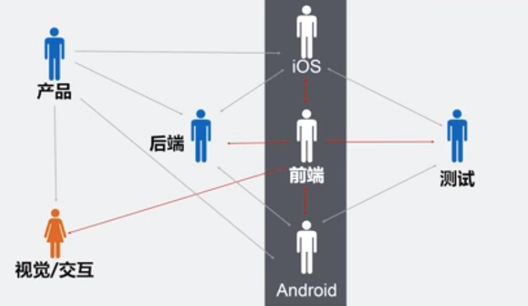
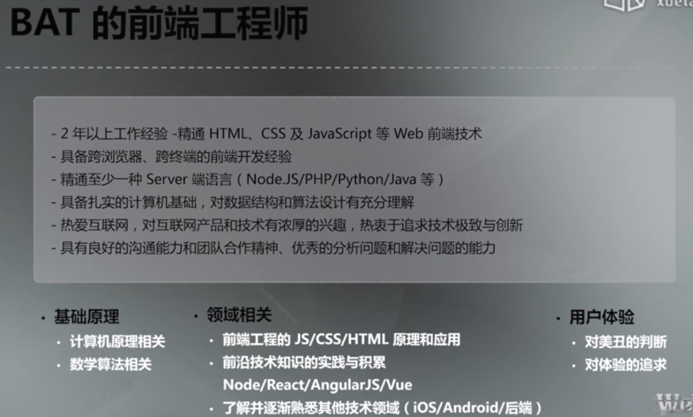
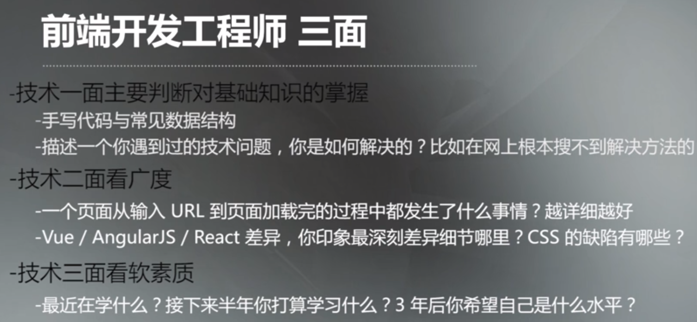
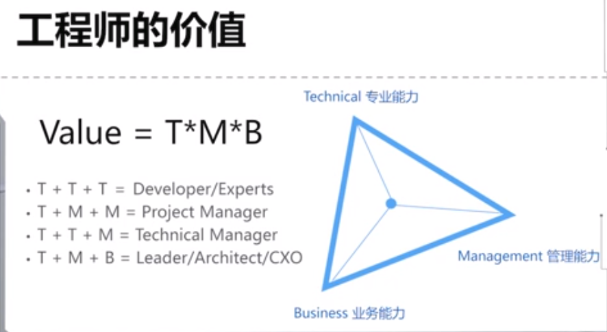
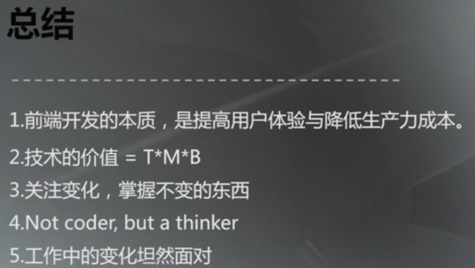

# 第0章-Web前端技术概述

## 前端工程师职业发展

前端工程师在生产链上所处位置示意图：

由此，可看到如下两点：

- 其是研发流程中的关键点
    - 业务杂事相对比较多，需要做好时间管理
    - （在此位置上）工程链路（从开发到设计到测试到上线）上各种优化可能性
- 另外需要业务开发上的沟通协调

常见的招聘描述以及一些要求：

前端工程师的三面：

工程师的价值以及后期从业职业：

工程师发展拓扑图：

经验：

总结：

工作上的勤奋无法掩盖思考上的懒惰。
